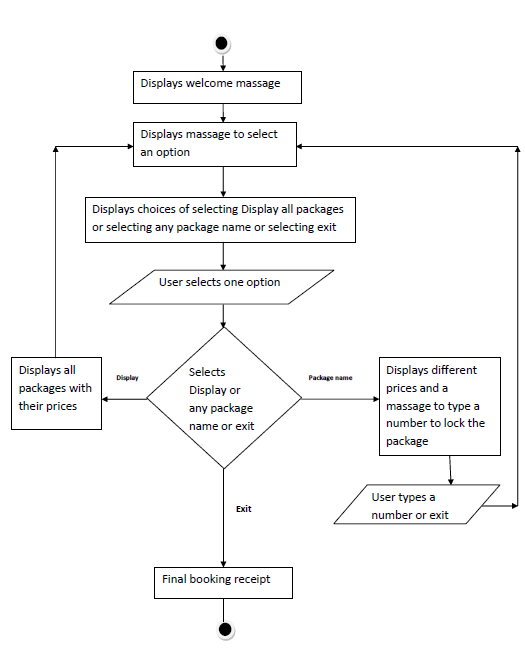

#Assignment-2
#The Terminal App
#SA PHOTOGRAPHY
## T1A2-1 Statement of Purpose and Scope
**What this app will do:**
The *SA PHOTOGRAPHY* is a terminal application where It allows  to choose or book photography sessions which is about capturing moments of your life. The packages it shows can be either of taking pictures or of taking videos. This app will allow you to book a session for different types of photo shoots and will let you know about the costs as well. So first it will allow you to display the packages and then you can select one or more packages and then finally you will be able to see your booked sessions and its total cost.

**Makes difficulties easier:**
This app can be a solution of different types of problem for both the interprenure and the customer. 

If you see from the view of point of the interprenure, it is way easier to update information on this app. As example you can see that you do not need to go to different places and advertise your work which is less time consuming and cost effective.

If you see from the view of point of a customer, it is so frustrating if you have no ideas of what type of packages do photography companies offer. So in this app we tried to put packages as simple as possible so that the customer can understand and book their desire sessions. Also customer can see our contact details so that if they have any queries they can just simply ask over the phone and email.Also customers have 24/7 access to this app to choose their options. Last but not the least, it is less time consuming and cost effective for customers as well.

**Target Audience:**
Another good thing about this app is that you have a vast variety of audience. It could be a couple who is going to get married, it could be an anniversary or birthday party, it could be a new born baby! So you can see your audience could be of any age or from any profession or background. 

**How the target audience will use it?**
As this app can help different types of audience, they can use it for different purposes such as wedding ceremony or anniversary etc. 
User can simply log into their computer. Then just go to "SA PHOTOGRAPHY" app.
1. Click on to "SA PHOTOGRAPHY" app.
2. Then it will come up with the option of displaying all the packages. So if user selects display, it will display all the packages with all the options of it. 
3. User will have an option to select a number to choose the package from the below ones.
* Signature Packages
* Super Saver Packages
* Wedding Film Packages
3. After selecting one option from above user will see another three options for each selected ones. 
4. Once the user is done with the selections they will be able to exit by selecting exit option. 

## T1A2-2 Features
There are some features I want to share here which are as below  
1. Display packages. 
2. Select packages.
3. Display the summary of booking.

#### Display packages: 
User can display packages from the given options. They can see the names and prices of all packages. User will see multiple options in each packages. 
For this feature I have used method called "display_all_packages" which created a concept of variable scope. Used the each loop. So this method will loop over all the packages and will show all the options of the packages. Used variable containing string.

#### Select packages:
In this section user will be told to select a number to choose their package of photography. Then they will just have to type the number and select one.
For this feature I have used method called "adding" and used the each_with_index loop. In method its creating a concept of variable scope. I used case as conditional control structure. 

#### Display the summary of booking:
In this app user can make a booking. To make a booking user can select one or more packages and book them together. I used a method called "printed_receipt" which comes up with the name of the packages the user selected and also shows the total price of the packages. 

If there is an error while you were saving a file it can be handled by printing an error to the screen.

## T1A2-3 User Interaction and Experience
Once the user is in SA PHOTOGRAPHY app, they can navigate to the packages they would like to choose by keying on the corresponding package or they can display all the packages by selecting display. The last option will allow user to select exit to exit. Once they exit, they can choose more packages if they want or they can just simply exit by selecting exit. When a user selects any package it comes up with three more options which is three different types of that package. Then user can just type the number of the package to choose one. In this way user can choose multiple packages. Once the selection is done, user will see a booking receipt which will show the names of the packages user selected and also they will see the total cost of the booked packages.
If user will type other numbers than the number showed in the application, the program will throw an error. The user needs to type the number from the given ones. As example, to select a package with cost user have to type the number 1 or 2 or 3.

## T1A2-4 Control Flow Diagram
Here is the Control Flow Diagram
  

Key for control flow diagram is as below:
* Circle - Initiation or termination of application
* Rectangle - Indicates process
* Parallelogram - Indicates an input 
* Diamond - Indicates decision
* -----> - Indicates direction of the flow

## T1A2-5 ########################

## T1A2-6 Status Updates
To see my status updates please click [here](development-log.md)

## T1A2-7 Implement Application
Please run application in terminal: ruby SA_PHOTOGRAPHY.rb

## T1A2-8 DRY (Don’t Repeat Yourself) coding principles
Please run application in terminal: ruby SA_PHOTOGRAPHY.rb

## T1A2-9 #########################

## T1A2-10  ##############################
## T1A2-11 Help File 

**Installation**
First of all you need a desktop or a laptop computer to run this application. A mobile or a tablet is not suitable for this. 

Windows:
* To download Ubuntu go to https://www.microsoft.com/en-us/p/ubuntu-1804-lts/9n9tngvndl3q?activetab=pivot:overviewtab

* In PowerShell running as Admin
Enable-WindowsOptionalFeature -Online -FeatureName Microsoft-Windows-Subsystem-Linux

* If it's complaining about the feature not being enabled.

* In the Ubuntu window run the following: apt policy ruby

* If the output looks like this: 
ruby:Candidate: 1:2.5.1

* Then you are good to run: sudo apt install ruby

* Open Terminal app

* Clone [Git repository](https://github.com/SumayaAlam19/Assignment1)
run build.sh 
change to the dist folder
* Run SA_Photography.rb in Terminal

**Dependencies required by the application to operate:**
To run  this application following installations are needed
* sudo gem install colorize
* sudo gem install tty-prompt

**Features** ##########################

## T1A2-12 Test Application

**Test 1**

test_signature_package tests the total price of all the package types in signature_package. If the actual result matches the expected result it is a pass else it is a fail.

**Test 2**

test_writing_receipt tests if the file exists it is a pass else it is a fail. I used it when it comes up with the booking receipt.

## T1A2-13 

